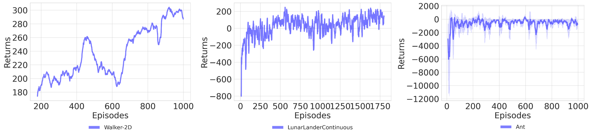

# QRSAC
Implementation of Quantile Regression Soft Actor Critic (QRSAC) from "Outracing champion Gran Turismo drivers with deep reinforcement learning" by Peter R. Wurman, Samuel Barrett, Kenta Kawamoto, James MacGlashan, Kaushik Subramanian, Thomas J. Walsh, Roberto Capobianco, Alisa Devlic, Franziska Eckert, Florian Fuchs, Leilani Gilpin, Piyush Khandelwal, Varun Kompella, HaoChih Lin, Patrick MacAlpine, Declan Oller, Takuma Seno, Craig Sherstan, Michael D. Thomure, Houmehr Aghabozorgi, Leon Barrett, Rory Douglas, Dion Whitehead, Peter Dürr, Peter Stone, Michael Spranger & Hiroaki Kitano. [[Paper]](https://www.nature.com/articles/s41586-021-04357-7)

This repository is based on [RLkit](https://github.com/vitchyr/rlkit) and [DSAC](https://github.com/xtma/dsac), two popular reinforcement learning frameworks implemented in PyTorch.
The core algorithm of QRSAC is in `rlkit/torch/qrsac/`

## Requirements
- python 3.10+
- All dependencies are available in requirements.txt and environment.yml

## Usage
You can write your experiment settings in configs/your_config.yaml and run with 
```
python qrsac.py --config your_config.yaml --gpu 0 --seed 0
```
Set `--gpu -1`, your program will run on CPU.

## Experiments
2 different experiments are conducted to validate the working of the QRSAC algorithm - on an donkercar simulator and on an real-world scaled RC car (Jetracer).

%### Experiments on Gym environments

%

### Experiments on DonkeyCar


### Experiments on JetRacer


